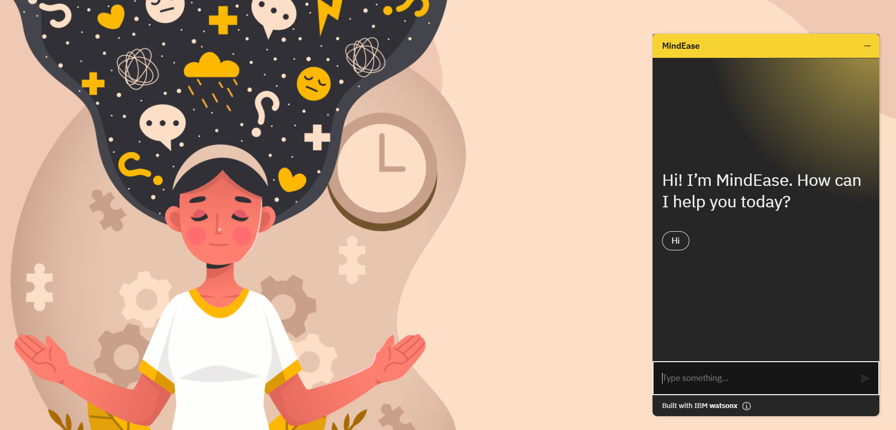
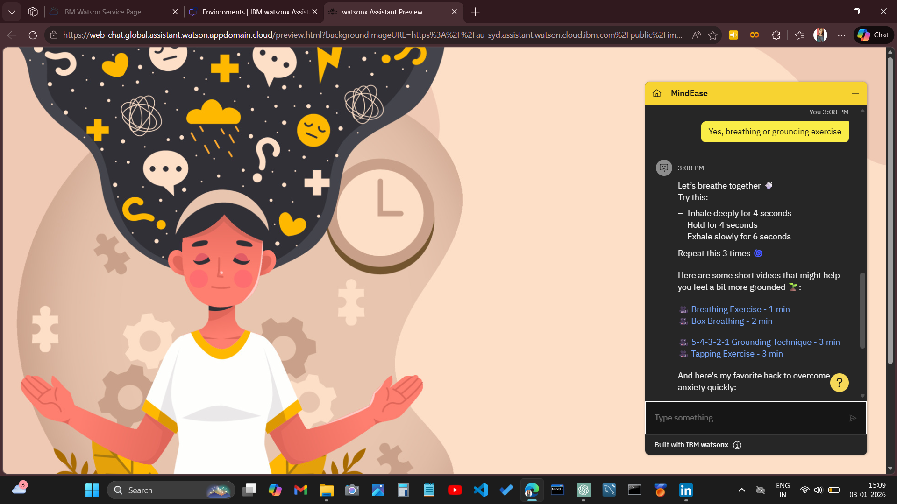
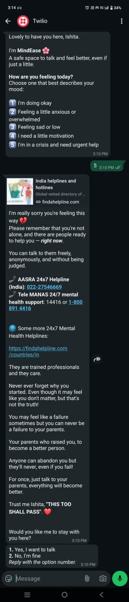

# 🌸 MindEase – A Mental Health Support Chatbot
> *A gentle space for heavy minds. ✨*

MindEase is a **rule-based mental health support chatbot** designed to provide emotional support, grounding guidance, and a safe space for users to express their feelings.  
It is built as a **practice project** during my **IBM SkillsBuild AI & Cloud Internship** journey, focusing on chatbot design and cloud deployment.

---

## 🧠 Why MindEase?

With the rapid growth of the tech industry, **stress, burnout, anxiety, and emotional fatigue** have become increasingly common—especially among students and professionals in tech.  
MindEase aims to offer **gentle, judgment-free support** by guiding users through structured conversations when they feel overwhelmed.

> ⚠️ Note: MindEase is **not a replacement for professional medical or psychological help**.

---

## ✨ Features

MindEase is a mental health support chatbot designed to offer a safe, comforting space where users can:

- 🌸 Identify how they’re feeling
- 🧘🏻‍♀️ Practice calming exercises (like box breathing & grounding)
- 🫂 Simply vent without judgment
- 💪🏻 Explore motivation and self-help resources
- 🚨 Use SOS options and professional links in critical situations  
- 🌐 Web-based chatbot interface  
- 💬 WhatsApp chatbot integration via Twilio  
- 🔐 No personal data storage  

---

## 📸 Screenshots

Here’s a quick look at *MindEase* in action:

#### 🌐 Web Interface

#### 📱 WhatsApp Integration

---

## 🌐 Live Links 

👉 Try MindEase on web: 

👉 For trying MindEase on WhatsApp, please follow the step-by-step instructions provided here: 
🔗 **[WhatsApp Deployment Instructions](./deployment/README.md)**

📝 **Note:** Please reply using the **option numbers** instead of full sentences, as this is a rule-based chatbot.

---

## 🧰 Tech Stack

- **IBM Watsonx Assistant** – Chatbot creation  
- **IBM Cloud** – Deployment  
- **Twilio API** – WhatsApp integration  
- **Rule-based dialog flow** (No NLP / No ML)

---

## 📚 Learning Outcome

Through this project, I learned:
- Designing conversational flows  
- Deploying AI services on IBM Cloud  
- Integrating chatbots with external platforms (WhatsApp)  
- Building empathetic UX for sensitive use cases  

---

## 🙏 Acknowledgements

- IBM SkillsBuild  
- Edunet Foundation  
- AICTE  
- IBM Watsonx Team  

---

## 🌼 Final Note

MindEase is a **learning-focused project** created to explore chatbot development and cloud deployment.  
Feedback and suggestions are always welcome!

💙 If you’re going through a tough time, please remember - you don’t have to face it alone.
